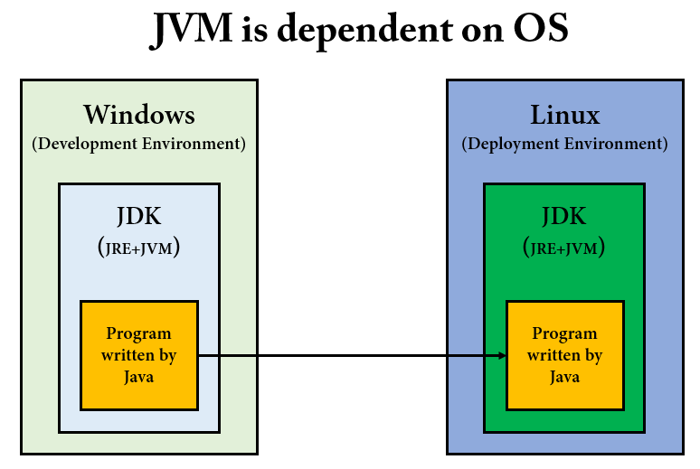
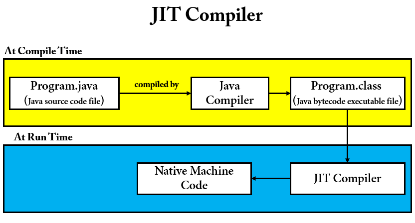

# Reflection 배우기 전 선수지식 학습

Reflection 을 제대로 이해하기 위해서는 JVM Architecture 에 대해 제대로 알고 있어야한다. 

## Execution of a Java Program

자바 프로그램이 실행되는 과정을 살펴보자.


1. IDE(Ex. IntelliJ)를 사용하여 Program.java 코드를 작성한다.
2. `Java Compiler(javac)` 가 자바 소스 코드를 참고하여 클래스 파일(Program.class)을 생성한다.
3. 생성된 클래스 파일은 JVM 이 설치되어있는 환경이면 어디에서든지 실행 가능하다.
4. JVM 은 바이트 코드를 `Interpreter` 를 사용하여 한 줄 씩 기계어로 번역한다.

자바는 `Compiler` 와 `Interpreter` 를 사용한다는 것을 알 수 있다. 각각 어떤 특징이 있고, 자바에서 왜 두 가지를 같이 쓰는지 배워보자.

## Compiler and Interpreter

[컴파일(Compilation)](https://www.webopedia.com/definitions/compilation/)이라는 단어를 먼저 살펴보자.

컴파일이란 [고수준 프로그래밍 언어(high-level programming language)](https://www.webopedia.com/definitions/high-level-language/)로 작성된 프로그램을 소스 코드에서 객체 코드(Object Code)로 변환하는 것을 의미한다.

- Source Code: 원시 코드
- Object Code: 목적 코드
  - Compiler 에 의해 생성된 코드를 의미한다.

그러면 `저수준 언어는(low level language)`는 무엇일까? 저수준 언어는 기계어나 어셈블리어를 의미하며, 고수준 프로그래밍 언어보다 하드웨어에 더 밀접한 언어이다.

컴파일러와 인터프리터는 `HLL` 로 작성된 프로그램을 기계어로 변환한다는 공통점이 있다. 단, 변환 과정에서 차이가 존재한다.

### Compiler

컴파일러만을 사용하는 대표적인 언어로 C 언어가 있다. 컴파일러는 런타임 이전에 전체 소스 코드를 기계어로 변환시킨다. `컴파일 결과물이 바로 기계어`가 되기 때문에 OS 에 종속적이다.
따라서, 대부분의 하드웨어 제어 시스템을 만들 때 C 언어를 쓰는 이유 중 하나가 Compiler 를 사용하기 때문이다.

컴파일러의 단점이라고 하면 프로그램 크기가 크면, 컴파일 타임이 증가한다는 것이 있겠다.

### Interpreter

인터프리터만을 사용하는 대표적인 언어로는 파이썬이 있다. 인터프리터는 소스 코드를 바로 기계어로 바꾸지 않고 `중간 단계`를 거친 뒤, 런타임 시에 한 줄씩 기계어로 해석한다. 
컴파일러와 달리 한 줄씩 해석하기 때문에 컴파일 방식보다는 속도가 느리다. 대신, 프로그램을 즉시 실행할 수 있으며 런타임에 디버깅 및 값 변경이 가능하다. 또한 플랫폼에 종속적이지 않다.

런타임에 코드를 구동시키기 때문에, 필요할 때마다 메모리에 올려서 사용한다. 이것을 `동적 적재(Dynamic Loading)`라고 한다.

> 중간 단계 언어 : Java 로 따지면 ByteCode, C# 으로 따지면 IL(Intermediate Language)

자바에서는 `ClassLoader` 를 사용하여 클래스를 `동적 적재(Dynamic Loading)`를 할 수 있다.

### 자바에서 Compiler 와 Interpreter 를 같이 사용하는 이유

__"자바는 WORA(Write Once Run Anywhere) 의 특징을 갖고 있고, 플랫폼에 독립적이다. 반면, JVM 은 플랫폼(OS)에 종속적이다."__ 이와 같은 말을 자바를 공부한 사람이라면 많이 들어봤을 것이다.

자바는 `Compiler` 를 사용하여 중간 단계 언어인 `바이트 코드`로 변환한 다음 Class Loader 가 클래스 파일을 JVM 의 메모리 영역(Memory Area)에 로드한다. 그리고 JVM 에서는 Interpreter 를 사용하여 기계어로 해석한다.

자바로 작성된 언어가 플랫폼에 종속적이지 않은 이유는 JVM 에서 Interpreter 를 사용하기 때문이다.

그러면 JVM 은 왜 플랫폼에 종속적일까?

__자바로 작성된 프로그램을 특정 OS 에 맞게 변경을 해줘야 하기 때문이다.__ 그림을 보면서 이해해보자.



개발 환경에서는 Windows 를 사용하고 배포 환경에서는 Linux 를 사용한다. 각 OS 에서는 Java 로 작성된 프로그램을 실행시키기 위해 `JDK`가 설치되어있어야 한다. 즉, 플랫폼에 종속적인것을 볼 수 있다. Oracle 에서 JDK 를 다운로드 받으려고하면 플랫폼을 선택할 수 있게 나온다. 자바로 작성된 프로그램은 어떤 OS 던지간에 JVM 만 설치되어있으면, JVM 이 Interpreter 를 사용하여 기계어로 해석하기 때문에, __자바는 플랫폼에 독립적이고, JVM 은 플랫폼에 종속이다.__

### JIT Compiler

자바로 작성된 프로그램은 느리다라는 말이 있다. Compiler 와 Interperter 의 특징을 기억하면 된다. 이러한 특징들 때문에, 자바에서 `JIT Compiler` 를 도입했다.

JIT(Just-In-Time) 컴파일러는 런타임 시 Java 기반 애플리케이션의 성능 최적화를 담당하는 JRE 의 필수 부분이다.



- JIT Compiler 는 런타임에 바이트 코드를 Native Machine Code 로 변환한다. 
- 같은 함수가 여러 번 호출되는 경우에, 기계어로 변환된 함수의 코드를 `캐싱`해두어서 재사용한다.
- 이름이 JIT(Just In Time)인 이유는, 기계어로의 변환은 코드가 실행 되는 과정(런타임)에 실시간으로 일어, 전체 코드의 필요한 부분만 변환하기 때문이다.
- 기계어로 변환된 코드는 캐시에 저장되기 때문에 재사용시 컴파일을 다시 할 필요가 없다.

> 바이트 코드(Byte Code) : JVM 이 이해할 수있는 0과 1로 구성된 이진 코드(Binary Code)
> 
> Native Machine Code : 기계어, 컴퓨터가 이해할 수 있는 0과 1로 구성된 이진 코드(Binary Code)
> 
> 따라서, 모든 이진 코드(Binary Code) 는 기계어가 아니다.

# JVM Architecture


## Class Loader

클래스 로더는 JVM 에 속하는 것일까? JRE 에 속하는 것일까? 답변은 [스택오버플로우 링크](https://stackoverflow.com/questions/43273876/is-the-classloader-part-of-the-jvm-or-in-the-jre)로 대체하겠다.

클래스 로더를 활용한 동적 적재(Dynamic Loading)하는 코드를 보자.

```java
public class ClassLoaderTest {

    @Test
    void dynamicLoadingUsingAClassLoader() throws Exception {
        final String binaryName = "reflection.study.reflection.classloader.code.User";
        Class<?> userClass = ClassLoader.getSystemClassLoader().loadClass(binaryName);
        Constructor<?> constructor = userClass.getConstructor(String.class);
        User user = (User) constructor.newInstance("JungHo");
        assertNotNull(user);
    }
}
```

loadClass 인자로 [바이너리 이름(Binary name)](https://cr.openjdk.java.net/~vromero/8210031/javadoc.21/java/lang/ClassLoader.html#binary-name)을 지정해야 하는데 FQCN(Full Qualified Class Name) 을 지정하면 된다.

> FQCN 은 패키지를 포함한 클래스의 전체 경로를 의미한다고 생각하면 된다.

클래스 로더의 동작 과정에 대해서 살펴보자.


클래스 로더는 로딩, 링크, 초기화 순으로 진행된다.

### 로딩(Loading)

- 클래스 로더가 `.class` 파일을 읽고 
- JVM 은 3 종류의 클래스 로더를 가지고 있다.
  - `Bootstrap`, `Extension`, `Application`
- 클래스 파일을 로드할 때, JVM 은 해당 클래스에 대한 종속성을 찾는다.
- Bootstrap 클래스 로더는 JAVA_HOME\lib 에 있는 `rt.jar` 파일을 스캔한다.
- 클래스가 발견되지 않으면, Extension 클래스 로더는 `jre(JAVA_HOME)/lib/ext` 폴더 또는 `java.ext.dirs` 시스템 변수에 해당하는 위치에 있는 클래스 파일을 검색한다.
- 다시 클래스가 발견되지 않으면 Application 클래스 로더는 애플리케이션 클래스패스(애플리케이션 실행할 때 주는 -classpath 옵션 또는 java.class.path 환경 변수의 값에 해당하는 위치)에서
클래스를 읽는다.

로딩 과정에서 클래스 로더가 `메서드`, `힙`, `스택` 영역에 데이터들을 저장한다.

- Method Area 에 저장되는 데이터
  - FQCN
  - 클래스, 인터페이스, Enum
  - 메서드와 변수

로딩이 끝나고 나서 해당 클래스 타입의 `Class 객체`를 생성하여 힙 영역에 저장한다.

### 링크

- 링크는 `Verfiy`, `Prepare`, `Resolve(Optional)` 세 단계로 나뉘어져 있다.
- 검증(Verify) : .class 파일 형식이 유효한지 체크
- 준비(Preparation) : 클래스 변수(static 변수)와 기본값에 필요한 메모리
- 해결(Resolve) : 심볼릭 레퍼런스를 메서드 영역에 있는 실제 레퍼런스로 교체한다.

> 심볼릭 레퍼런스(Symbolic Reference) : 클래스 파일은 JVM 이 프로그램을 실행할 때 필요한 API 를 Link 할 수 있도록 심볼릭 레퍼런스를 가진다. 심볼릭 레퍼런스를 런타임 시점에 메모리 상에서 실제로 존재하는 물리적인 주소로 대체하는 Linking 작업이 일어난다. 심볼릭 레퍼런스는 참조하는 대상의 이름을 지칭하고, 클래스 파일이 JVM 에 올라가게 되면 심볼릭 레펀선스는 실제 메모리 주소가 아닌 이름에 맞는 객체의 주소를 찾아서 연결하는 작업을 수행한다. 

### 초기화

클래스 로딩의 마지막 단계이며, 여기에서 모든 정적 변수는 원래 값으로 할당되고 정적 블록(static block)이 실행된다.

## JVM 메모리 영역

JVM 메모리 영역에 대해서 살펴보자.

- __메서드(Method Area = Class Area = Static Area)__
  - FQCN, 메타데이터, 클래스 멤버 변수 이름, 데이터 타입, 리턴타입, 상수풀, static 변수 등이 저장된다.
  - 클래스 수준의 정보가 저장되며, 여기에 저장된 정보들은 공유 된다.
- __힙(Heap)__
  - Heap 영역에는 주로 긴 생명주기를 가지는 데이터들이 저장된다. (대부분의 오브젝트는 크기가 크고, 서로 다른 코드 블럭에서 공유되는 경우가 많다.)
  - 애플리케이션의 모든 메모리 중 stack 에 있는 데이터를 제외한 부분이라고 보면 된다.
  - 모든 Object 타입(Integer, String, ArrayList, ...)은 heap 영역에 생성된다.
  - 몇개의 스레드가 존재하든 상관없이 단 하나의 heap 영역만 존재한다.
  - Heap 영역에 있는 오브젝트들을 가리키는 레퍼런스 변수가 stack 에 올라가게 된다
  - 여기에 저장된 정보들은 공유 된다.
- __스택(Stack)__
  - 자바에서는 스레드가 생성 될 때 마다 스택 영역이 개별적으로 생성된다.
  - 스레드가 메서드 호출 시, 지역변수, 매개변수 등이 저장된다.
  - Heap 영역에 생성된 Object 타입 | 데이터의 참조 변수(Reference Variable)가 할당된다.
    - Ex. String ref = "abc";
    - 실제로 Heap 영역에는 String | "abc" 이런식으로 들어가고, ref 의 참조 변수가 stack 에 할당된다.
  - 원시 타입의 데이터가 값과 함께 할당된다.
  - 지역변수들은 scope 에 따른 visibility 를 가진다.
  - 가장 마지막에 호출한 함수가 종료 되어야 이전에 호출한 함수들도 종료가 된다.
  - 스택은 `Call Frame(Call Stack)` 이라는 것을 가진다.
    - 재귀 함수는 함수가 호출될 때마다 Call Frame(호출 프레임)의 정보들이 스택 메모리에 저장된다.
      - `호출 함수의 return address`
        - 스택에서 "가장 마지막에 호출한 함수가 종료 되어야 이 전에 호출한 함수들도 종료가 된다." 라고 했다. 호출 함수의 return address 가 있기에 돌아올 위치를 알 수 있는 것이다.
      - `피호출 함수의 매개변수 와 지역변수`
- __PC Registers__
  - 현재 실행 중인 명령문의 물리적 메모리 주소를 저장한다. Java 에서 각 스레드에는 별도의 PC Register 가 있다.
- __Native Method Stacks__
  - 자바 언어 이외의 언어로 작성된 코드를 저장하는 메모리 영역이다. 
  - 주로 native 키워드가 붙은 애들이 저장된다.
  - 네이티브 코드의 명령을 보유한다.

## References

- https://docs.oracle.com/javase/tutorial/reflect/TOC.html
- https://tecoble.techcourse.co.kr/post/2020-07-16-reflection-api/
- https://docs.oracle.com/javase/8/docs/api/java/lang/Class.html
- https://howtodoinjava.com/java/basics/jdk-jre-jvm/
- https://aboullaite.me/understanding-jit-compiler-just-in-time-compiler/
- https://www.webopedia.com/definitions/compilation/
- https://www.webopedia.com/definitions/interpreter/
- https://cr.openjdk.java.net/~vromero/8210031/javadoc.21/java/lang/ClassLoader.html
- https://codevang.tistory.com/84?category=827598
- https://dailyworker.github.io/fundamental-JVM-classloader/
- https://catch-me-java.tistory.com/11
- https://stackoverflow.com/questions/43273876/is-the-classloader-part-of-the-jvm-or-in-the-jre
- https://opensourceforgeeks.blogspot.com/2013/03/difference-between-compiler-interpreter.html
- https://www.geeksforgeeks.org/just-in-time-compiler/
