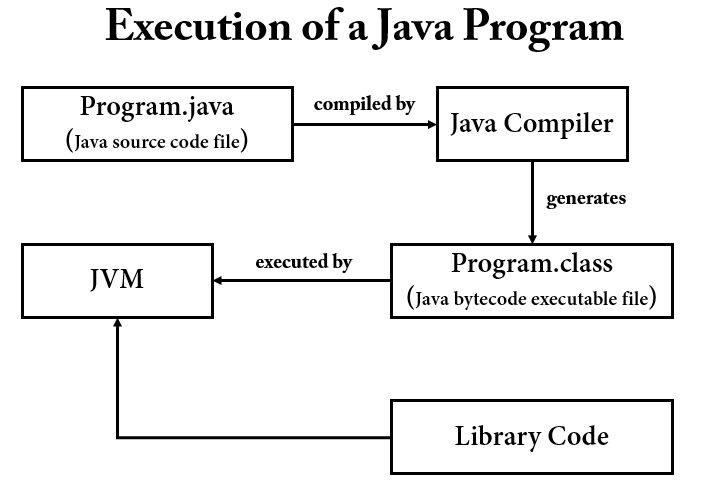

# Java Reflection

## Reflection 이란 ?

리플렉션은 일반적으로 JVM 에서 실행되는 애플리케이션의 `런타임(Runtime)`에 동작을 검사하거나 수정하는 기능이 필요한 프로그램에서 사용된다. 리플렉션은 Java 기능 중 `고급 기능`에 속하며, 
일반적으로 리플렉션을 활용하여 개발할 일은 극히 드물다. 

리플렉션을 사용하면 `동적(dynamic, runtime)`으로 다음과 같은 일을 할 수 있다.

- 클래스 객체(`Class<T>`) 생성
- 클래스 객체로 인스턴스 생성
- 클래스에 있는 필드, 생성자, 메서드 정보를 조회, 동작, 수정
  - 단, 생성자의 매개변수 정보는 가져올 수 없다.

리플렉션은 프레임워크나 라이브러리에서 자주 사용된다. 예를 들면, 스프링 프레임워크에서 클래스를 빈으로 등록할때, 개발자가 어떤 클래스를 빈으로 등록할지는 아무도 모른다. 따라서 이런한 과정을
동적으로 해결하기 위해서 리플렉션이 사용된다고 보면된다. `스프링의 DI(Dependency Injection)`같은 경우에도 리플렉션이 사용된다.

## JVM Architecture

Reflection 을 제대로 이해하기 위해서는 JVM Architecture 와 Class Loader 동작 과정을 이해해야 한다. 

### Execution of a Java Program

자바 프로그램이 실행되는 과정을 살펴보자.

1. IDE(Ex. IntelliJ)를 사용하여 Program.java 코드를 작성한다.
2. Java Compiler(javac) 가 자바 소스 코드를 참고하여 클래스 파일(Program.class)을 생성한다.
3. 생성된 클래스 파일은 JVM 이 설치되어있는 환경이면 어디에서든지 실행 가능하다.
4. JVM 은 바이트 코드를 Interpreter 를 사용하여 한 줄 씩 기계어로 번역한다.

### Class Loader

Class Loader 는 로딩, 링크, 초기화 순으로 진행된다.

### 로딩(Loading)

- 클래스 로더가 `.class` 파일을 읽고 

## Reflection API : 클래스 정보 조회

[Reflection API 클래스 정보 조회](https://github.com/BAEKJungHo/java-reflection/blob/main/src/src/test/java/reflection/study/reflection/reflectionapi/ReflectionAPIFindClassInformationTest.java)

## Reflection API : 클래스 정보 수정 및 실행

[Reflection API 클클래스 정보 수정 및 실행](https://github.com/BAEKJungHo/java-reflection/blob/main/src/src/test/java/reflection/study/reflection/reflectionapi/ReflectionAPIModifyAndExecuteClassInformationTest.java)

## Reflection API : 애노테이션

[Reflection API : 클래스내에 지정된 애노테이션 정보 조회](https://github.com/BAEKJungHo/java-reflection/blob/main/src/src/test/java/reflection/study/reflection/reflectionapi/ReflectionAPIAnnotationTest.java)

## References

- https://docs.oracle.com/javase/tutorial/reflect/TOC.html
- https://tecoble.techcourse.co.kr/post/2020-07-16-reflection-api/
- https://docs.oracle.com/javase/8/docs/api/java/lang/Class.html
- https://howtodoinjava.com/java/basics/jdk-jre-jvm/
- https://aboullaite.me/understanding-jit-compiler-just-in-time-compiler/
