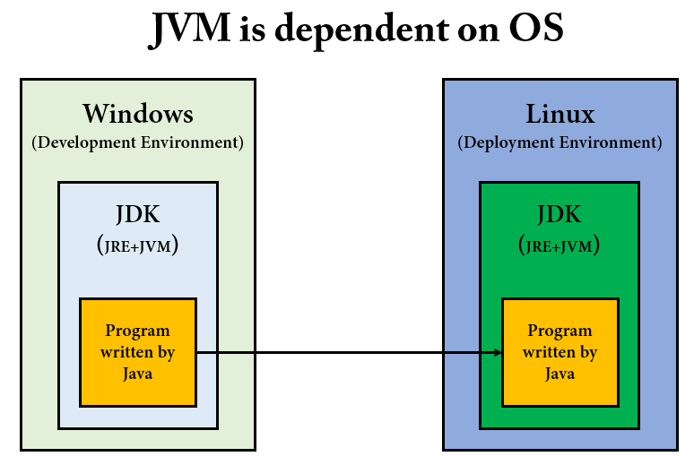
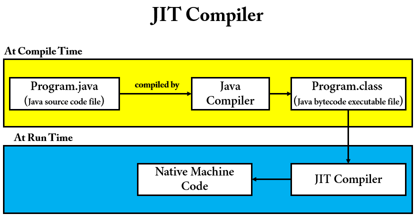

# Java Reflection

## Reflection 이란 ?

리플렉션은 일반적으로 JVM 에서 실행되는 애플리케이션의 `런타임(Runtime)`에 동작을 검사하거나 수정하는 기능이 필요한 프로그램에서 사용된다. 리플렉션은 Java 기능 중 `고급 기능`에 속하며, 
일반적으로 리플렉션을 활용하여 개발할 일은 극히 드물다. 

리플렉션을 사용하면 `동적(dynamic, runtime)`으로 다음과 같은 일을 할 수 있다.

- 클래스 객체(`Class<T>`) 생성
- 클래스 객체로 인스턴스 생성
- 클래스에 있는 필드, 생성자, 메서드 정보를 조회, 동작, 수정
  - 단, 생성자의 매개변수 정보는 가져올 수 없다.

리플렉션은 프레임워크나 라이브러리에서 자주 사용된다. 예를 들면, 스프링 프레임워크에서 클래스를 빈으로 등록할때, 개발자가 어떤 클래스를 빈으로 등록할지는 아무도 모른다. 따라서 이런한 과정을
동적으로 해결하기 위해서 리플렉션이 사용된다고 보면된다. `스프링의 DI(Dependency Injection)`같은 경우에도 리플렉션이 사용된다.

## JVM Architecture

Reflection 을 제대로 이해하기 위해서는 JVM Architecture 와 Class Loader 동작 과정을 이해해야 한다. 

### Execution of a Java Program

자바 프로그램이 실행되는 과정을 살펴보자.


1. IDE(Ex. IntelliJ)를 사용하여 Program.java 코드를 작성한다.
2. `Java Compiler(javac)` 가 자바 소스 코드를 참고하여 클래스 파일(Program.class)을 생성한다.
3. 생성된 클래스 파일은 JVM 이 설치되어있는 환경이면 어디에서든지 실행 가능하다.
4. JVM 은 바이트 코드를 `Interpreter` 를 사용하여 한 줄 씩 기계어로 번역한다.

자바는 `Compiler` 와 `Interpreter` 를 사용한다는 것을 알 수 있다. 각각 어떤 특징이 있고, 자바에서 왜 두 가지를 같이 쓰는지 배워보자.

### Compiler and Interpreter

[컴파일(Compilation)](https://www.webopedia.com/definitions/compilation/)이라는 단어를 먼저 살펴보자.

컴파일이란 [고수준 프로그래밍 언어(high-level programming language)](https://www.webopedia.com/definitions/high-level-language/)로 작성된 프로그램을 소스 코드에서 객체 코드(Object Code)로 변환하는 것을 의미한다.

- Source Code: 원시 코드
- Object Code: 목적 코드
  - Compiler 에 의해 생성된 코드를 의미한다.

그러면 `저수준 언어는(low level language)`는 무엇일까? 저수준 언어는 기계어나 어셈블리어를 의미하며, 고수준 프로그래밍 언어보다 하드웨어에 더 밀접한 언어이다.

컴파일러와 인터프리터는 `HLL` 로 작성된 프로그램을 기계어로 변환한다는 공통점이 있다. 단, 변환 과정에서 차이가 존재한다.

#### Compiler

컴파일러만을 사용하는 대표적인 언어로 C 언어가 있다. 컴파일러는 런타임 이전에 전체 소스 코드를 기계어로 변환시킨다. `컴파일 결과물이 바로 기계어`가 되기 때문에 OS 에 종속적이다.
따라서, 대부분의 하드웨어 제어 시스템을 만들 때 C 언어를 쓰는 이유 중 하나가 Compiler 를 사용하기 때문이다.

컴파일러의 단점이라고 하면 프로그램 크기가 크면, 컴파일 타임이 증가한다는 것이 있겠다.

#### Interpreter

인터프리터만을 사용하는 대표적인 언어로는 파이썬이 있다. 인터프리터는 소스 코드를 바로 기계어로 바꾸지 않고 `중간 단계`를 거친 뒤, 런타임 시에 한 줄씩 기계어로 해석한다. 
컴파일러와 달리 한 줄씩 해석하기 때문에 컴파일 방식보다는 속도가 느리다. 대신, 프로그램을 즉시 실행할 수 있으며 런타임에 디버깅 및 값 변경이 가능하다. 또한 플랫폼에 종속적이지 않다.

런타임에 코드를 구동시키기 때문에, 필요할 때마다 메모리에 올려서 사용한다. 이것을 `동적 적재(Dynamic Loading)`라고 한다.

> 중간 단계 언어 : Java 로 따지면 ByteCode, C# 으로 따지면 IL(Intermediate Language)

자바에서는 `ClassLoader` 를 사용하여 클래스를 `동적 적재(Dynamic Loading)`를 할 수 있다.

### 자바에서 Compiler 와 Interpreter 를 같이 사용하는 이유

__"자바는 WORA(Write Once Run Anywhere) 의 특징을 갖고 있고, 플랫폼에 독립적이다. 반면, JVM 은 플랫폼(OS)에 종속적이다."__ 이와 같은 말을 자바를 공부한 사람이라면 많이 들어봤을 것이다.

자바는 `Compiler` 를 사용하여 중간 단계 언어인 `바이트 코드`로 변환한 다음 Class Loader 가 클래스 파일을 JVM 의 메모리 영역(Memory Area)에 로드한다. 그리고 JVM 에서는 Interpreter 를 사용하여 기계어로 해석한다.

자바로 작성된 언어가 플랫폼에 종속적이지 않은 이유는 JVM 에서 Interpreter 를 사용하기 때문이다.

그러면 JVM 은 왜 플랫폼에 종속적일까?

__자바로 작성된 프로그램을 특정 OS 에 맞게 변경을 해줘야 하기 때문이다.__ 그림을 보면서 이해해보자.



개발 환경에서는 Windows 를 사용하고 배포 환경에서는 Linux 를 사용한다. 각 OS 에서는 Java 로 작성된 프로그램을 실행시키기 위해 `JDK`가 설치되어있어야 한다. 즉, 플랫폼에 종속적인것을 볼 수 있다. Oracle 에서 JDK 를 다운로드 받으려고하면 플랫폼을 선택할 수 있게 나온다. 자바로 작성된 프로그램은 어떤 OS 던지간에 JVM 만 설치되어있으면, JVM 이 Interpreter 를 사용하여 기계어로 해석하기 때문에, __자바는 플랫폼에 독립적이고, JVM 은 플랫폼에 종속이다.__

### JIT Compiler

자바로 작성된 프로그램은 느리다라는 말이 있다. Compiler 와 Interperter 의 특징을 기억하면 된다. 이러한 특징들 때문에, 자바에서 `JIT Compiler` 를 도입했다.

JIT(Just-In-Time) 컴파일러는 런타임 시 Java 기반 애플리케이션의 성능 최적화를 담당하는 JRE 의 필수 부분이다.



- JIT Compiler 는 런타임에 바이트 코드를 Native Machine Code 로 변환한다. 
- 같은 함수가 여러 번 호출되는 경우에, 기계어로 변환된 함수의 코드를 `캐싱`해두어서 재사용한다.
- 이름이 JIT(Just In Time)인 이유는, 기계어로의 변환은 코드가 실행 되는 과정(런타임)에 실시간으로 일어, 전체 코드의 필요한 부분만 변환하기 때문이다.
- 기계어로 변환된 코드는 캐시에 저장되기 때문에 재사용시 컴파일을 다시 할 필요가 없다.

> 바이트 코드(Byte Code) : JVM 이 이해할 수있는 0과 1로 구성된 이진 코드(Binary Code)
> 
> Native Machine Code : 기계어, 컴퓨터가 이해할 수 있는 0과 1로 구성된 이진 코드(Binary Code)
> 
> 따라서, 모든 이진 코드(Binary Code) 는 기계어가 아니다.

### Class Loader

클래스 로더는 JVM 에 속하는 것일까? JRE 에 속하는 것일까? 답변은 [스택오버플로우 링크](https://stackoverflow.com/questions/43273876/is-the-classloader-part-of-the-jvm-or-in-the-jre)로 대체하겠다.

클래스 로더를 활용한 동적 적재(Dynamic Loading)하는 코드를 보자.

```java
public class ClassLoaderTest {

    @Test
    void dynamicLoadingUsingAClassLoader() throws Exception {
        final String binaryName = "reflection.study.reflection.classloader.code.User";
        Class<?> userClass = ClassLoader.getSystemClassLoader().loadClass(binaryName);
        Constructor<?> constructor = userClass.getConstructor(String.class);
        User user = (User) constructor.newInstance("JungHo");
        assertNotNull(user);
    }
}
```

loadClass 인자로 [바이너리 이름(Binary name)](https://cr.openjdk.java.net/~vromero/8210031/javadoc.21/java/lang/ClassLoader.html#binary-name)을 지정해야 하는데 FQCN(Full Qualified Class Name) 을 지정하면 된다.

> FQCN 은 패키지를 포함한 클래스의 전체 경로를 의미한다고 생각하면 된다.

클래스 로더의 동작 과정에 대해서 살펴보자.


클래스 로더는 로딩, 링크, 초기화 순으로 진행된다.

### 로딩(Loading)

- 클래스 로더가 `.class` 파일을 읽고 

## Reflection API : 클래스 정보 조회

[Reflection API 클래스 정보 조회](https://github.com/BAEKJungHo/java-reflection/blob/main/src/src/test/java/reflection/study/reflection/reflectionapi/ReflectionAPIFindClassInformationTest.java)

## Reflection API : 클래스 정보 수정 및 실행

[Reflection API 클클래스 정보 수정 및 실행](https://github.com/BAEKJungHo/java-reflection/blob/main/src/src/test/java/reflection/study/reflection/reflectionapi/ReflectionAPIModifyAndExecuteClassInformationTest.java)

## Reflection API : 애노테이션

[Reflection API : 클래스내에 지정된 애노테이션 정보 조회](https://github.com/BAEKJungHo/java-reflection/blob/main/src/src/test/java/reflection/study/reflection/reflectionapi/ReflectionAPIAnnotationTest.java)

## References

- https://docs.oracle.com/javase/tutorial/reflect/TOC.html
- https://tecoble.techcourse.co.kr/post/2020-07-16-reflection-api/
- https://docs.oracle.com/javase/8/docs/api/java/lang/Class.html
- https://howtodoinjava.com/java/basics/jdk-jre-jvm/
- https://aboullaite.me/understanding-jit-compiler-just-in-time-compiler/
- https://www.webopedia.com/definitions/compilation/
- https://www.webopedia.com/definitions/interpreter/
- https://cr.openjdk.java.net/~vromero/8210031/javadoc.21/java/lang/ClassLoader.html
- https://codevang.tistory.com/84?category=827598
- https://dailyworker.github.io/fundamental-JVM-classloader/
- https://catch-me-java.tistory.com/11
- https://stackoverflow.com/questions/43273876/is-the-classloader-part-of-the-jvm-or-in-the-jre
- https://opensourceforgeeks.blogspot.com/2013/03/difference-between-compiler-interpreter.html
- https://www.geeksforgeeks.org/just-in-time-compiler/
