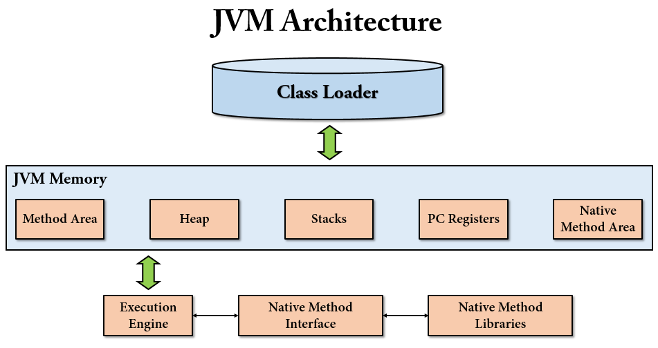
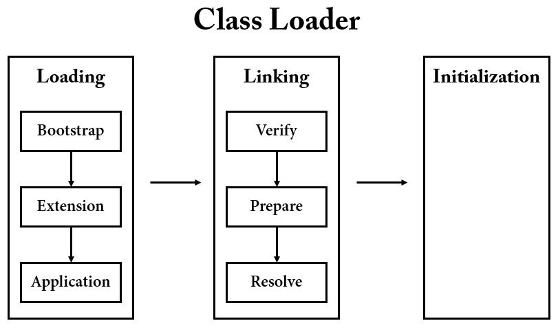

# JVM Architecture



## 다양한 JVM 구현체

[Execution of a Java Program](https://github.com/BAEKJungHo/deepdiveinreflection/blob/main/contents/01.%20Execution%20of%20Java%20Program.md) 에서 자바는 플랫폼 독립적이며,
JVM 은 플랫폼 종속적이라는 내용에 대해서 배웠다. 따라서, JVM 은 다양한 구현체 들이 존재한다. 예를들어 JPA 와 Hibernate 같은 경우를 생각하면 이해가 편한데,
Oracle 에서 JVM 의 스펙과 표준을 정의하면, 공급업체 들이 JVM 을 구현하여 배포하게 된다. 이 공급업체를 `Vendor` 라고 한다. 

### Hotspot JVM vs Open J9 JVM

Hotspot JVM 은 가장 자주 사용되고, 검증이 잘된 JVM 이다. [AdoptOpenJDK](https://adoptopenjdk.net/) 에서는 HotSpot 과 OpenJ9 두 개의 JVM 을 제공한다.

Open J9의 경우 이클립스 재단으로부터 만들어진 VM이다. Hotspot JVM보다 더 적은 메모리 자원을 사용하는 것을 강점으로 내세우고 있다. IBM 에서도 이 OpenJ9 를 사용하고 있고, 실제 벤치마킹 사례를 보면 메모리 사용률은 OpenJ9 가 훨씬 더 적은 사용률을 보이는 것을 확인하였다.

[Eclipse 재단의 OpenJ9 벤치마킹](https://www.youtube.com/watch?v=LmmwtquTpQs)

[sdk man](https://www.lesstif.com/java/sdkman-commandline-jdk-113345558.html) 으로 설치 가능한 JDK 를 검색하면 다음과 같이 Identifier 에 j9 과 hs 가 붙는 제품들이 있습니다. 여기서 j9 가 OpenJ9 JVM 이며, hs 가 Hotspot 을 의미한다.

[OpenJ9 와 Hotspot 성능 비교표](https://www.eclipse.org/openj9/performance/)

주의할 점은 j9 는 JVM 의 또 다른 구현물이며 JDK 의 버전과는 바로 매칭되지 않으며 AdoptOpenJDK 는 2 개의 JVM(j9, hs) 이 따로 패키징 되어 있다. 즉, "JDK 11 + j9 JVM" 구성이나 "JDK 11 + hs JVM" 구성이 가능하다.

[해당 글](https://www.lesstif.com/java/java-open-j9-hs-hotspot-jvm-121012290.html)의 필자 생각으로는 Cloud 에서 Java 로 개발한 app 을 서비스한다면 Cloud 서비스 업체가 구현한 JDK(JVM) 가 가장 최적화되어 있지 않을까 생각되며 필자도 그렇게 사용하고 있다고 한다.
즉, AWS 를 쓴다면 Amazon 의 JDK 인 Corretto 를 사용하고 Azure 에서는 Microsoft 의 OpenJDK 를 쓰는게 좋다고 생각한다고 한다.

## Class Loader

클래스 로더는 JVM 에 속하는 것일까? JRE 에 속하는 것일까? 답변은 [스택오버플로우 링크](https://stackoverflow.com/questions/43273876/is-the-classloader-part-of-the-jvm-or-in-the-jre)로 대체하겠다.

클래스 로더를 활용한 동적 적재(Dynamic Loading)하는 코드를 보자.

```java
public class ClassLoaderTest {

    @Test
    void dynamicLoadingUsingAClassLoader() throws Exception {
        final String binaryName = "reflection.study.reflection.classloader.code.User";
        Class<?> userClass = ClassLoader.getSystemClassLoader().loadClass(binaryName);
        Constructor<?> constructor = userClass.getConstructor(String.class);
        User user = (User) constructor.newInstance("JungHo");
        assertNotNull(user);
    }
}
```

loadClass 인자로 [바이너리 이름(Binary name)](https://cr.openjdk.java.net/~vromero/8210031/javadoc.21/java/lang/ClassLoader.html#binary-name)을 지정해야 하는데 FQCN(Full Qualified Class Name) 을 지정하면 된다.

ClassLoader 는 동적 적재라는 방식을 사용하여 로딩, 링크, 초기화 과정을 수행하여 .class 파일을 JVM 의 RunTimeDataArea 즉, 메모리 영역에 넣는 작업을 담당한다.

> FQCN 은 패키지를 포함한 클래스의 전체 경로를 의미한다고 생각하면 된다.

클래스 로더의 동작 과정에 대해서 살펴보자.



클래스 로더는 로딩, 링크, 초기화 순으로 진행된다.

### 로딩(Loading)

- 클래스 로더가 `.class` 파일을 읽고 
- JVM 은 3 종류의 클래스 로더를 가지고 있다.
  - `Bootstrap`, `Extension`, `Application`
- 클래스 파일을 로드할 때, JVM 은 해당 클래스에 대한 종속성을 찾는다.
- Bootstrap 클래스 로더는 JAVA_HOME\lib 에 있는 `rt.jar` 파일을 스캔한다. 해당 파일에서 `런타임 코어 클래스`를 로드한다.
  - 자바 8 까지는 런타임 코어 클래스는 rt.jar 파일에서 가져온다. 자바 9 이후 부터는 런타임이 모듈화되고 클래스로딩 개념 자체가 많이 달라졌다고 한다.
  - Bootstrap 클래스 로더의 핵심 역할
    - 다른 클래스로더가 나머지 시스템에 필요한 클래스를 로드할 수 있도록 최소한의 필수 클래스(Ex. java.lang.Object, Class, ClassLoader 등)만 로드한다. 
- 클래스가 발견되지 않으면, Extension 클래스 로더는 `jre(JAVA_HOME)/lib/ext` 폴더 또는 `java.ext.dirs` 시스템 변수에 해당하는 위치에 있는 클래스 파일을 검색한다.
- 다시 클래스가 발견되지 않으면 Application 클래스 로더는 애플리케이션 클래스패스(애플리케이션 실행할 때 주는 -classpath 옵션 또는 java.class.path 환경 변수의 값에 해당하는 위치)에서
클래스를 읽는다.

로딩 과정에서 클래스 로더가 `메서드`, `힙`, `스택` 영역에 데이터들을 저장한다.

- Method Area 에 저장되는 데이터
  - FQCN
  - 클래스, 인터페이스, Enum
  - 메서드와 변수

로딩이 끝나고 나서 해당 클래스 타입의 `Class 객체`를 생성하여 힙 영역에 저장한다.

### 링크

- 링크는 `Verfiy`, `Prepare`, `Resolve(Optional)` 세 단계로 나뉘어져 있다.
- 검증(Verify) : .class 파일 형식이 유효한지 체크
- 준비(Preparation) : 클래스 변수(static 변수)와 기본값에 필요한 메모리
- 해결(Resolve) : 심볼릭 레퍼런스를 메서드 영역에 있는 실제 레퍼런스로 교체한다.

> 심볼릭 레퍼런스(Symbolic Reference) : 클래스 파일은 JVM 이 프로그램을 실행할 때 필요한 API 를 Link 할 수 있도록 심볼릭 레퍼런스를 가진다. 심볼릭 레퍼런스를 런타임 시점에 메모리 상에서 실제로 존재하는 물리적인 주소로 대체하는 Linking 작업이 일어난다. 심볼릭 레퍼런스는 참조하는 대상의 이름을 지칭하고, 클래스 파일이 JVM 에 올라가게 되면 심볼릭 레펀선스는 실제 메모리 주소가 아닌 이름에 맞는 객체의 주소를 찾아서 연결하는 작업을 수행한다. 

### 초기화

클래스 로딩의 마지막 단계이며, 여기에서 모든 정적 변수는 원래 값으로 할당되고 정적 블록(static block)이 실행된다.

### 분석

```java
public class ClassLoaderTest {

    @Test
    void dynamicLoadingUsingAClassLoader() throws Exception {
        final String binaryName = "reflection.study.reflection.classloader.code.User";
        Class<?> userClass1 = ClassLoader.getSystemClassLoader().loadClass(binaryName);
        Class<?> userClass2 = ClassLoader.getSystemClassLoader().loadClass(binaryName);
    }
}
```

메서드에서 userClass1 의 클래스 객체를 가져오는 코드를 실행하게 되는 순간 ClassLoader 의 loadClass가 호출된다.

```java
@Override
protected Class<?> loadClass(String cn, boolean resolve)
    throws ClassNotFoundException
{
    // for compatibility reasons, say where restricted package list has
    // been updated to list API packages in the unnamed module.
    SecurityManager sm = System.getSecurityManager();
    if (sm != null) {
        int i = cn.lastIndexOf('.');
        if (i != -1) {
            sm.checkPackageAccess(cn.substring(0, i));
        }
    }

    return super.loadClass(cn, resolve);
}
```

마지막 줄에서 Super Class 에서 구현된 loadClass 를 호출하는데, 여기서 Super Class 는 `BuiltinClssLoader`이다.

```java
@Override
protected Class<?> loadClass(String cn, boolean resolve)
    throws ClassNotFoundException
{
    Class<?> c = loadClassOrNull(cn, resolve);
    if (c == null)
        throw new ClassNotFoundException(cn);
    return c;
}
```

위 메서드에서 `loadClassOrNull` 를 통해서 실제 클래스 객체를 찾게 된다.

```java
/**
 * A variation of {@code loadClass} to load a class with the specified
 * binary name. This method returns {@code null} when the class is not
 * found.
 */
protected Class<?> loadClassOrNull(String cn, boolean resolve) {
    synchronized (getClassLoadingLock(cn)) {
        // check if already loaded
        Class<?> c = findLoadedClass(cn);

        if (c == null) {

            // find the candidate module for this class
            LoadedModule loadedModule = findLoadedModule(cn);
            if (loadedModule != null) {

                // package is in a module
                BuiltinClassLoader loader = loadedModule.loader();
                if (loader == this) {
                    if (VM.isModuleSystemInited()) {
                        c = findClassInModuleOrNull(loadedModule, cn);
                    }
                } else {
                    // delegate to the other loader
                    c = loader.loadClassOrNull(cn);
                }

            } else {

                // check parent
                if (parent != null) {
                    c = parent.loadClassOrNull(cn);
                }

                // check class path
                if (c == null && hasClassPath() && VM.isModuleSystemInited()) {
                    c = findClassOnClassPathOrNull(cn);
                }
            }

        }

        if (resolve && c != null)
            resolveClass(c);

        return c;
    }
}
```

- 현재 클래스 로더에서 이미 로드된 객체가 있는지 확인한다.
    - 맨 처음에는 가장 하위 계층에 존재하는 `AppClassLoader` 인 상태이다.
- findLoadedModule(cn); 을 통해 로드된 모듈이 존재하는지 찾는다.
    - cn 을 인자로 넘겨서 pn 을 만들어서 찾는다.
    - cn : Class Name
        - reflection.study.reflection.classloader.code.User
    - pn : Package Name
        - reflection.study.reflection.classloader.code
- 존재하지 않으면, 자기 부모 클래스 로더를 통해서, 클래스 객체를 찾는다.
    - 초기 : AppClassLoader
    - 부모 : PlatformClassLoader
    - 최상위 부모 : BootClassLoader
- 클래스 패스가 존재하는지 체크하고, 클래스 패스를 통해서 클래스를 찾는다.
    - c = findClassOnClassPathOrNull(cn);
    - 이 과정에서 사용되는 클래스 로더는 `PlatformClassLoader` 이다.
  
이러한 과정을 거치고 userClass2 를 찾는 코드가 실행되면, 이미 로드된 클래스가 존재하므로 `AppClassLoader` 선에서 정리가 가능하다. 즉, Super Class Loader 들을 거칠 필요 없이 바로 찾을 수 있다.

## JVM 메모리 영역

JVM 메모리 영역에 대해서 살펴보자.

- __메서드(Method Area = Class Area = Static Area)__
  - FQCN, 메타데이터, 클래스 멤버 변수 이름, 데이터 타입, 리턴타입, 상수풀, static 변수 등이 저장된다.
  - 클래스 수준의 정보가 저장되며, 여기에 저장된 정보들은 공유 된다.
- __힙(Heap)__
  - Heap 영역에는 주로 긴 생명주기를 가지는 데이터들이 저장된다. (대부분의 오브젝트는 크기가 크고, 서로 다른 코드 블럭에서 공유되는 경우가 많다.)
  - 애플리케이션의 모든 메모리 중 stack 에 있는 데이터를 제외한 부분이라고 보면 된다.
  - 모든 Object 타입(Integer, String, ArrayList, ...)은 heap 영역에 생성된다.
  - 몇개의 스레드가 존재하든 상관없이 단 하나의 heap 영역만 존재한다.
  - Heap 영역에 있는 오브젝트들을 가리키는 레퍼런스 변수가 stack 에 올라가게 된다
  - 여기에 저장된 정보들은 공유 된다.
- __스택(Stack)__
  - 자바에서는 스레드가 생성 될 때 마다 스택 영역이 개별적으로 생성된다.
  - 스레드가 메서드 호출 시, 지역변수, 매개변수 등이 저장된다.
  - Heap 영역에 생성된 Object 타입 | 데이터의 참조 변수(Reference Variable)가 할당된다.
    - Ex. String ref = "abc";
    - 실제로 Heap 영역에는 String | "abc" 이런식으로 들어가고, ref 의 참조 변수가 stack 에 할당된다.
  - 원시 타입의 데이터가 값과 함께 할당된다.
  - 지역변수들은 scope 에 따른 visibility 를 가진다.
  - 가장 마지막에 호출한 함수가 종료 되어야 이전에 호출한 함수들도 종료가 된다.
  - 스택은 `Call Frame(Call Stack)` 이라는 것을 가진다.
    - 재귀 함수는 함수가 호출될 때마다 Call Frame(호출 프레임)의 정보들이 스택 메모리에 저장된다.
      - `호출 함수의 return address`
        - 스택에서 "가장 마지막에 호출한 함수가 종료 되어야 이 전에 호출한 함수들도 종료가 된다." 라고 했다. 호출 함수의 return address 가 있기에 돌아올 위치를 알 수 있는 것이다.
      - `피호출 함수의 매개변수 와 지역변수`
- __PC Registers__
  - 현재 실행 중인 명령문의 물리적 메모리 주소를 저장한다. Java 에서 각 스레드에는 별도의 PC Register 가 있다.
- __Native Method Stacks__
  - 자바 언어 이외의 언어로 작성된 코드를 저장하는 메모리 영역이다. 
  - 주로 native 키워드가 붙은 애들이 저장된다.
  - 네이티브 코드의 명령을 보유한다.
  - ```java
    // C 언어로 구현된 currentThread
    public static native Thread currentThread();
    ```
    
## JDK 8 에서 새롭게 등장한 Metaspace 영역

JDK 8 이전에는 `Metaspace` 영역 대신 `Permanent Heap` 이라는 영역이 존재했다. `Permanent Generation` 메모리 영역이라고도 하며, 줄여서 `PermGen` 영역이라고도 한다.
해당 영역은 JVM 에 의해서 크기가 강제되던 영역이다.

[What's New in JDK 8](https://www.oracle.com/java/technologies/javase/8-whats-new.html) 의 HotSpot 항목에서 `Removal of PermGen` 라고 나온다.

- __JDK 8 이전 HotSpot JVM__
    - `Java Heap`
        - Eden
        - S0 : Survivor 0
        - S1 : Survivor 1
        - Old
    - `Permanent Heap`
        - Permanent
    - `Native Memory`
        - C Heap
        - Thread Stack
- __JDK 8 이후 HotSpot JVM__
    - `Java Heap`
        - Eden
        - S0 : Survivor 0
        - S1 : Survivor 1
        - Old
    - `Native Memory`
        - Metaspace
        - C Heap
        - Thread Stack

> Metaspace 영역은 Heap이 아닌 Native 메모리 영역으로 취급하게 된다. Heap 영역은 JVM에 의해 관리되는 영역이며, Native 메모리는 OS 레벨에서 관리하는 영역으로 구분된다. Metaspace가 Native 메모리를 이용함으로서 개발자는 영역 확보의 상한을 크게 의식할 필요가 없어지게 되었다.

### JDK 8 이전의 PermGen 영역

- __PermGen__
    - 클래스와 메서드의 메타데이터 저장
    - Non-Heap Memory
    - java.lang.OutOfMemoryError: PermGen space
    - 상수풀 정보
    - JVM, JIT 관련 데이터
    - `-XX:PermSize(min), -XX:MaxPermSize(max)` 로 사이즈 조정
    - Default로 제한된 크기를 갖고 있다.
        - 32-bit JVM : 64 MB
        - 64-bit JVM : 82 MB
- __Java Heap__
    - PermGen 에 있는 클래스의 인스턴스 저장
    - java.lang.OutOfMemoryError: Java heap space
    - `-Xms(min), -Xmx(max)`로 사이즈 조정

즉, 정리된 내용을 보면 Java Heap 은 우리가 흔히 알고있는 Heap 영역을 의미하고, PermGen 영역은 우리가 알고 있는 Method 영역의 특징을 지닌다.

[메서드 영역](https://d2.naver.com/helloworld/1230) : 메서드 영역은 모든 스레드가 공유하는 영역으로 JVM 이 시작될 때 생성된다. JVM 이 읽어 들인 각각의 클래스와 인터페이스에 대한 런타임 상수 풀, 필드와 메서드 정보, Static 변수, 메서드의 바이트코드 등을 보관한다. 메서드 영역은 JVM 벤더마다 다양한 형태로 구현할 수 있으며, 오라클 핫스팟 JVM(HotSpot JVM)에서는 흔히 Permanent Area, 혹은 Permanent Generation(PermGen)이라고 불린다. 메서드 영역에 대한 가비지 컬렉션은 JVM 벤더의 선택 사항이다.

즉, Oracle HotSpot JVM 기준으로는 메서드 영역을 `PermGen` 이라고 정의하고 있다고 보면된다.

### JDK 8 이후

JDK 8 부터 PermGen 영역은 삭제되고, PermGen 영역에 저장되는 애들이 Heap 과 Metaspace 공간으로 분리되어 저장되어진다. 

PermGen 영역에 존재하던 Static Object 는 Heap 영역으로 옮겨져서 GC 의 대상이 될 수 있도록 하였다.

## References

- https://docs.oracle.com/javase/8/docs/api/java/lang/Class.html
- https://howtodoinjava.com/java/basics/jdk-jre-jvm/
- https://cr.openjdk.java.net/~vromero/8210031/javadoc.21/java/lang/ClassLoader.html
- https://dailyworker.github.io/fundamental-JVM-classloader/
- https://stackoverflow.com/questions/43273876/is-the-classloader-part-of-the-jvm-or-in-the-jre
- https://johngrib.github.io/wiki/java8-why-permgen-removed/
- https://goodgid.github.io/Java-8-JVM-Metaspace/
- https://dzone.com/articles/java-8-permgen-metaspace
- http://wiki.x2bee.com/pages/viewpage.action?pageId=7766559
- https://minkukjo.github.io/language/2020/06/02/Java-01/
- https://www.lesstif.com/java/java-open-j9-hs-hotspot-jvm-121012290.html
- https://blog.naver.com/simjunbo/221080829920
